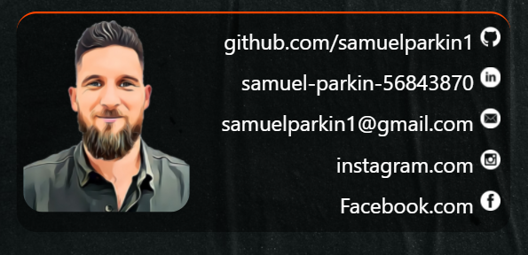

# Samuel Parkin Portfolio Website.  

**Table of Contents**  

+ [ Published portfolio website. ](#portfolio_website)
+ [ Samuel Parkin's Portfolio Page repository.](#Github_link)
+ [ Description portfolio website. ](#Description) 
    + [ Purpose. ](#Purpose)
    + [ Target audience. ](#Target_audience)
    + [ Sitemap. ](#Sitemap)
    + [ Tech stack. ](#Tech_stack)
    + [ Validation and report ](#validation_report)  
      * [ Desktop light house report ](#Desktop_light_house_report)
      * [ Mobile light house report ](#Mobile_light_house_report)
      * [ XML validation results ](#XML_validation_results)
      * [ Google Ownership Verification ](#Google_Ownership_Verification) 
    + [ Functionality / features. ](#Functionality)  
      * [ Scrolling Header ](#Scrolling_Header)
      * [ Hamburger menu for Phone browser. ](#Hamburger_menu_for_Phone_browser)
      * [ Top Navigation selection and hover for desktop browser. ](#Top_Navigation_selection)  
      * [ Hovering footer links for desktop browser.](#Hovering_footer_links)
      * [ "content tile/card".](#"content_tile/card")
    + [ Screenshots. ](#Screenshots)  
      * [ Home Page. ](#Home_Page)
      * [ Experience. ](#Experience)
      * [ Blog. ](#Blog)
      * [ Connect. ](#Connect)  
___  

## Published portfolio website.
Samuel Parkin's Portfolio pages can be found at [samuelparkin1.github.io/](https://samuelparkin1.github.io/)  

[ *Back to Table of Contents* ](#Table_of_Contents)
    
___ 

## Portfolio Page repository. 
To review all code and documents associated to Samuel Parkin's Portfolio Page go to  [github.com/samuelparkin1](https://github.com/samuelparkin1/samuelparkin1.github.io)  

[ *Back to Table of Contents* ](#Table_of_Contents)
    
___ 

## Description of Samuel Parkin's portfolio website.
  
  
### Purpose.
The purpose of this portfolio website is to showcases my talent, abilities and coding experience. Creating a portfolio website is a great way to share these skills with others and potential employers.   

[ *Back to Table of Contents* ](#Table_of_Contents)
    
___ 

  
### Target audience.
The target audience for this portfolio website is for potential employers / clients that are seeking to engage with myself as a dev and/or IT professional.
This portfolio will show case my professionalism and a positive work ethic.
The portfolio has been developed recognizing that there will be an understanding of technical knowledge relating to information technology, software development/coding, programming languages and development stacks by an employer.

[ *Back to Table of Contents* ](#Table_of_Contents)
    
___  

  
### Sitemap. 
 The below site map helps illustrate the flow and content of my portfolio.

 The content on the **Home page** shares with the visitor 'who I am' and that 'I am an expiring Dev IT professional'. I have used my wording in the content to show my personality as someone who is friendly and approachable. 

Within the **Experience** page I have showcased my IT skills by sharing my knowledge within different coding languages and coding practices. It also shares my previous work history and abilities and goes on to sharing a link to a PDF of my resume.  

The **Blog** pages show 5 of my latest interests within the IT space.

Finally, on the **Connect** page shows where to find links to professional accounts such GitHub and LinkedIn and also an email address so I can be contacted directly.

  

[ *Back to Table of Contents* ](#Table_of_Contents)
   
___

  
### Tech stack. 
The tech stack diagram shows the flow and list all the technology services used to build the Portfolio website.  

In the **Design** stage, Balsamiq Wireframe was used to generate digital sketches of the ideas and concept to be used on the portfolio.

While in the **Create** stage, VS studio was used to write the HTML and CSS code. Throughout the **Create** stage GIT was continuously used as the repository system. At the final stage of creating the portfolio XML-Sitemaps was used to create the portfolios XML code.

When the site was ready to **Deploy**, the final code was uploaded to GitHub in order to be view by the web. The Lighthouse tool helped ensure that the Portfolio page has adequate performance and accessibility. To improve search visibility, Google Search Console was used to help in the measuring of the portfolios search traffic and performance.  

  

[ *Back to Table of Contents* ](#Table_of_Contents)
    
___

  
### Validation and reports.  
Below are the Portfolios Validation and reports that the site received during its deployment stage.  

 
+ Desktop light house report:
<a href="docs\Screenshots\desktop_light_house_report.pdf">Desktop light house report.pdf</a>.  

+ Mobile light house report:
<a href="docs\Screenshots\Mobile_light_house_report.pdf">Mobile light house report.pdf</a>.  

+ XML validation results  

  
  

+ Google Ownership Verification 

    

[ *Back to Table of Contents* ](#Table_of_Contents)
    
___  
  
  
### Functionality / features.  

  
+ ### Scrolling Header.    
  Each page shares a common theme with a Scrolling transition within the Header. As the content is scrolled up, the title within the header transitions from black to white.  

    
  
   

+ ### Hamburger menu for Phone browser.  
  When the Portfolio is being viewed by a mobile device, the top navigation menu changes to a hamburger style menu. When the menu is opened, links to the other pages fill the screen. This is to make is easier to select which page to go to when on a small screen. 

    
    
   

+ ### Top Navigation selection and hover for desktop browser.
  When in a Desktop browser the top navigation bar will put an orange border around the tab of the current page. When selecting another page's tab, the tab will change to a solid orange colour.

  
      
    

  
  + ### Hovering footer links for desktop browser.
    Each page shares a common footer theme with links to professional and social media accounts. When the mouse hovers over an icon, the icon will lift slightly to indicate it has been selected.  

    
      
   

+ ### content tile/card.
 All content has been presented on it own rile /card. This was used to bring the focus of the user to just on that contents information. 
    
    

[ *Back to Table of Contents* ](#Table_of_Contents)
    
___

  
### Screenshots.  

    
  + #### Home page.
    + ##### Desktop.  
      
    + ##### Tablet.  
         
    + ##### Mobile.  
        

[ *Back to Table of Contents* ](#Table_of_Contents)
    
___   

    
  + #### Experience.  
    + ##### Desktop  
      
    + ##### Tablet  
      
    + ##### Mobile  
        

[ *Back to Table of Contents* ](#Table_of_Contents)
    
___ 

    
  + #### Blog.  
    + ##### Desktop  
       
    + ##### Tablet  
       
    + ##### Mobile  
         

[ *Back to Table of Contents* ](#Table_of_Contents)
    
___

    
  + #### Connect.  
     + ##### Desktop.
        
     + ##### Tablet. 
        
    + ##### Mobile. 
          

[ *Back to Table of Contents* ](#Table_of_Contents)
    
___

